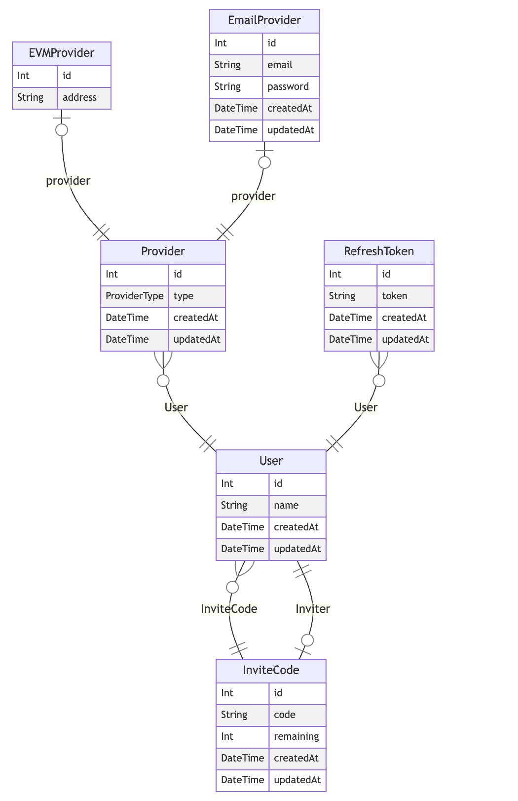

# Mocaverse Invite Code System

## Table of Contents
1. [System Design](#system-design)
   - [Invite Code Generation](#invite-code-generation)
   - [Database Schema](#database-schema)
   - [API Endpoints](#api-endpoints)
2. [Implementation](#implementation)
   - [Technologies Used](#technologies-used)
   - [Project Structure](#project-structure)
3. [Setup Instructions](#setup-instructions)
   - [Prerequisites](#prerequisites)
   - [Installation](#installation)
   - [Running the Application](#running-the-application)
4. [Testing](#testing)
   - [Unit Tests](#unit-tests)
   - [Integration Tests](#integration-tests)
   - [Load Testing](#load-testing)
5. [Design Decisions and Reasoning](#design-decisions-and-reasoning)
   - [Invite Code Format](#invite-code-format)
   - [Database Choice](#database-choice)
   - [Concurrency Handling](#concurrency-handling)
   - [Security Measures](#security-measures)
6. [Future Improvements](#future-improvements)

## System Design

### Database Schema

The system utilizes a relational database to store and manage invite codes. The schema includes tables for users, invite codes, and their relationships. This structure allows for efficient tracking of code usage, remaining invites, and user associations.

  

### API Endpoints

The system exposes several RESTful API endpoints for interacting with invite codes:

- `POST /auth/register-with-email`: Register a new user with an invite code
- `POST /auth/login-with-email`: Authenticate a user
- `POST /auth/refresh`: Refresh an authentication token
- `POST /auth/logout`: Log out a user

## Implementation

### Technologies Used

- Backend: Node.js with Express.js
- Database: PostgreSQL with Prisma ORM
- API Design: ts-rest for type-safe API contracts
- Authentication: JSON Web Tokens (JWT)
- Testing: Jest for unit and integration tests

### Project Structure

The project follows a modular architecture using NX workspace:

- `libs/feature-auth`: Contains authentication-related modules
- `libs/mocaverse-prisma-client`: Prisma client for database interactions
- `libs/shared-api`: Shared API contracts
- `apps/mocaverse-server`: Main server application

## Setup Instructions

### Prerequisites

- Node.js (v18 or later)
- pnpm package manager
- PostgreSQL database

### Installation

1. Clone the repository
2. Run `pnpm install` to install dependencies
3. Set up environment variables (refer to `.env.example`)
4. Run database migrations: `pnpm nx run mocaverse-prisma-schema:migrate`

### Running the Application

1. Start the server: `pnpm nx run mocaverse-server:serve`
2. The API will be available at `http://localhost:3000`

## Testing

### Unit Tests

Run unit tests with: `pnpm nx run-many -t test`

### Integration Tests

Run integration tests with: `pnpm nx run mocaverse-server-e2e:e2e`

### Load Testing

(Instructions for load testing to be added)

## Design Decisions and Reasoning

### Invite Code Format

We chose a 6-character alphanumeric format for invite codes, balancing uniqueness with user-friendliness. This format provides a large number of possible combinations while remaining easy for users to input.

### Database Choice

PostgreSQL was selected for its robustness, ACID compliance, and excellent support for complex queries and transactions, which are crucial for managing invite codes and user data.

### Concurrency Handling

The system uses database transactions to handle concurrent invite code usage, ensuring that each code is only used once and preventing race conditions.

### Security Measures

- Bcrypt for password hashing
- JWT for secure authentication
- Rate limiting on API endpoints to prevent abuse

## Future Improvements

1. Implement a caching layer for frequently accessed invite codes
2. Add support for bulk invite code generation
3. Develop an admin interface for invite code management
4. Implement analytics to track invite code usage and user acquisition
