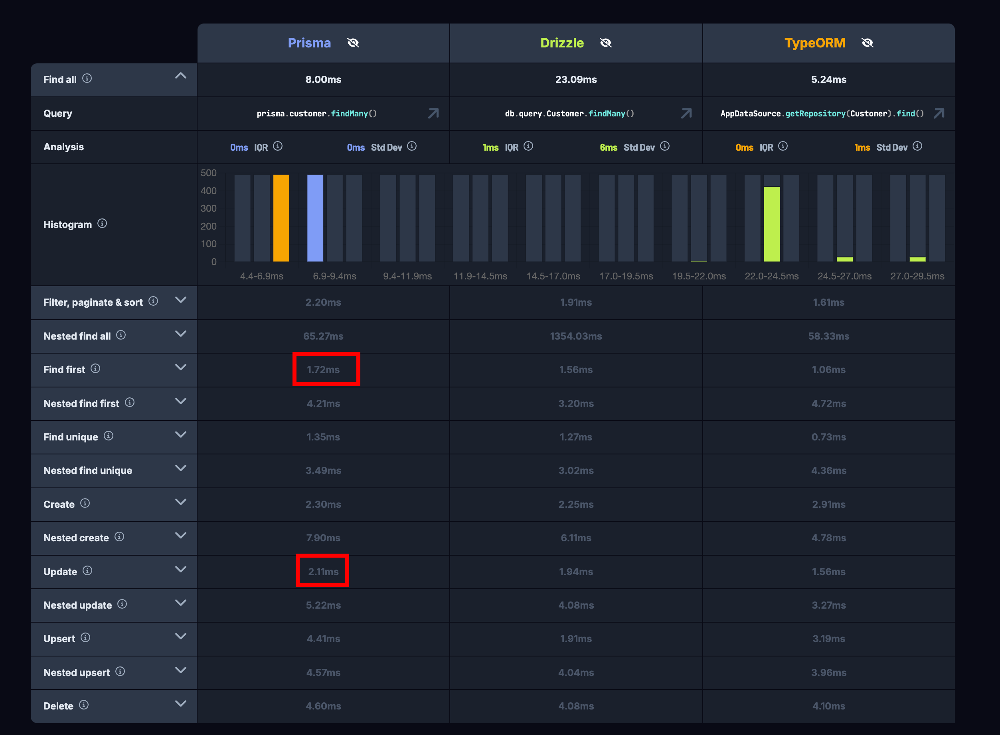
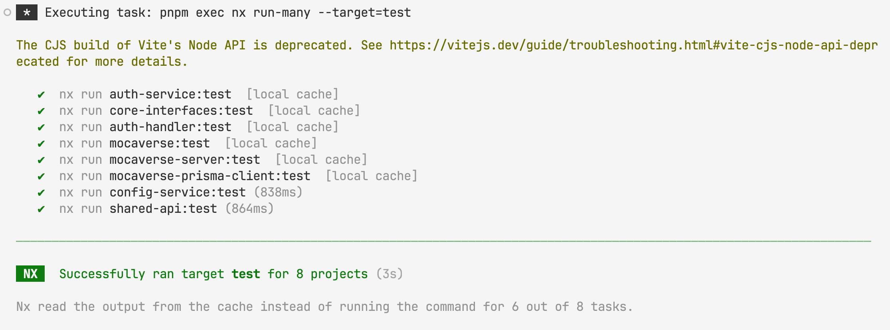

# Mocaverse Invite Code System (Backend)

## Getting Started

## 🖥️ Backend
For backend setup and development instructions, refer to the sections below.

## 🎨 Frontend
For frontend-related information and setup, please check the [apps/mocaverse/README.md](apps/mocaverse/README.md) file.

## 📜 Smart Contracts
For smart-contract related information and setup, please check the [Mocaverse NFT Gate Repository](https://github.com/tinwritescode/mocaverse-nft-gate).

## System Design

### Database Schema

<p align="center">
  
</p>

- One user can have one invite code (Inviter)
- One invite code can be used by many users (InviteCode)
- One user can has many refresh tokens (session management)
- One user can has many providers (for future multi-login support)
- A Provider has a type (ProviderType):
  - EVM Wallet
  - Email

### Decision Reasoning
#### Invite codes need to have a limit on usage (once or multiple times)

| Options | Decision | Reasoning |
|---------|----------|-----------|
| Invite code can have two types: `ONCE` or `MULTIPLE` | ❌ | - We don't have lots of types of invite codes, so it's not worth having two types. |
| Invite code has a remaining count (`remaining`), when it is used up (0), it is no longer valid | ✅ | - It is easier to implement and understand. |

Decision made:
- Invite code has a remaining count (`remaining`), when it is used up (0), it is no longer valid

#### Invite codes should be hard to guess, but also not too hard to type

| Consideration | Details |
|---------------|---------|
| User Base | ~1 million users |
| Ease of Use | - Easy to type<br>- Avoid lowercase/uppercase confusion<br>- No special characters |
| Security | Short but hard to guess |

Decision made:
- Format: 8 characters, alphanumeric, uppercase only
- Collision rate: 0.002686% (pool of 36^8 = 2,821,109,907,456 combinations)
- Benefits:
  - Easy for users to input and communicate
  - Reduced ambiguity by using only uppercase letters
  - Frontend can auto-convert input to uppercase

#### Invite codes are associated with a unique user account

| Options | Decision | Reasoning |
|---------|----------|-----------|
| Invite code is associated with a unique email address (a provider) | ❌ | - If a user has multiple providers in the future, it would be difficult to determine which provider the invite code is for. |
| Invite code is associated with a user | ✅ | - Allows for flexibility with multiple providers per user<br>- Simplifies tracking and management of invite codes |

Decision made:
- Invite code is associated with a user

Reasoning:
- If invite code is associated with a provider, in the future, if a user has many providers, it is hard to tell which provider the invite code is for.

#### Invite codes should be trackable, admin should be able to know who the referrer is
- invite code is associated with an inviter
- initial invite code does not have inviter

#### Design should be able to withstand high traffic and concurrency
<p align="center">
  
</p>

- Add index to `code` field to speed up the search
- Let's say a database transaction may take 30ms (for example) for running `findFirst` and `update` methods (and network latency).
- Request per second (RPS) = 1000 / 30 = 33.33

#### Design should be hard to hack
- Invite code is hard to guess, so it is hard to hack (because of the low collision rate)
- We have a rate limit on API (register with email) to prevent abuse

### API Endpoints

The system exposes several RESTful API endpoints for interacting with invite codes:

- `POST /auth/register-with-email`: Register a new user with an invite code
- `POST /auth/login-with-email`: Authenticate a user
- `POST /auth/refresh`: Refresh an authentication token
- `POST /auth/logout`: Log out a user

## Implementation

### Technologies Used

- Backend: Node.js with Express.js
- Database: PostgreSQL with Prisma ORM
- API Design: ts-rest for type-safe API contracts
- Authentication: JSON Web Tokens (JWT)
- Testing: Jest for unit and integration tests

## Setup Instructions

### Prerequisites

- Node.js (v18 or later)
- pnpm package manager
- PostgreSQL database

### Installation

1. Clone the repository
2. Run `pnpm install` to install dependencies
3. Set up environment variables (refer to `.env.example`)
4. Start the database using Docker Compose:
   ```
   docker-compose up -d
   ```

   This will start a PostgreSQL container and create a sample database `mocaverse` with the following credentials:
   - Username: `johndoe`
   - Password: `randompassword`
   - Database: `mydb` 
   - Port: `5434`

5. Push the database schema:
   ```
   pnpm nx run mocaverse-prisma-schema:push
   ```
6. Seed the database:
   ```
   pnpm nx run mocaverse-prisma-schema:seed
   ```

### Running the Application

1. Start the server:
   ```
   pnpm nx run mocaverse-server:serve
   ```

3. The API will be available at `http://localhost:3000`

## Testing

### Unit Tests

Run unit tests with: `pnpm nx run-many -t test`




### Integration Tests

Run integration tests with: `pnpm nx run mocaverse-server-e2e:e2e`

### Database Choice

We chose PostgreSQL as our database system for the following reasons:
- One of the most popular relational databases
- Enough features for our system
- Mature and well-documented

We paired PostgreSQL with Prisma ORM due to:
- Very strong type safety
- Easy to add models, and it also handles database migrations
- One of the best database ORM for TypeScript

### Security Measures

- Bcrypt for password hashing
- JWT for secure authentication
- Rate limiting on API endpoints to prevent abuse

## Future Improvements

- For larger amount of request per second, we need to use a more scalable database system, such as Redis.
- Limit one user can only have one email provider
