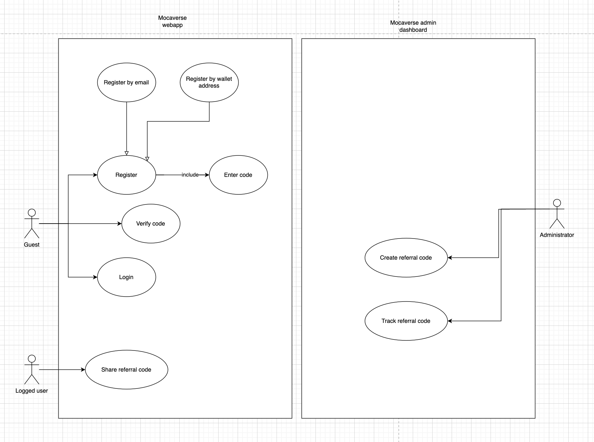

# Test case plan

To have a test plan, we should make a use case diagram first. Let's say we have two system: `Mocaverse webapp` and `Mocaverse admin dashboard`. 

Let's focus on `Mocaverse webapp` first.

We have two actor in this use case: `Guest` and `Logged User`.

Guest have 3 use case: `Login`, `Register`, `Verify invite code`.

After Login, guest will become `Logged User`, and they can share their invite code, or using more logged user features that we will add later.

Let's break down the use cases into smaller test cases:

## Login

Let's say we have `login with email`, and `login with wallet address`.

Cases we will have: 
For login with email:
- Login with invalid email or password
- Login with valid email and password

For login with wallet address:
- Login with valid wallet address
- Login with invalid wallet address

## Register

Same with Login, we will have use cases:

For register with email:
- Email is already registered
- Password is not valid (less than 8 characters, rule we will add later)
- Password is not match with confirm password
- Register with valid email and password

For register with wallet address:
- Wallet address is already registered
- Signature is not valid (wrong signature)
- Expired signature
- Invalid invite code
- Register with valid wallet address, valid signature, and valid invite code

## Verify invite code

Test cases:
- Verify with invalid invite code
- Verify with valid invite code
- Verify with zero remaining uses of invite code

## Share invite code

Test cases:
- User can see invite code

## Improvements

- Write detail each test cases
